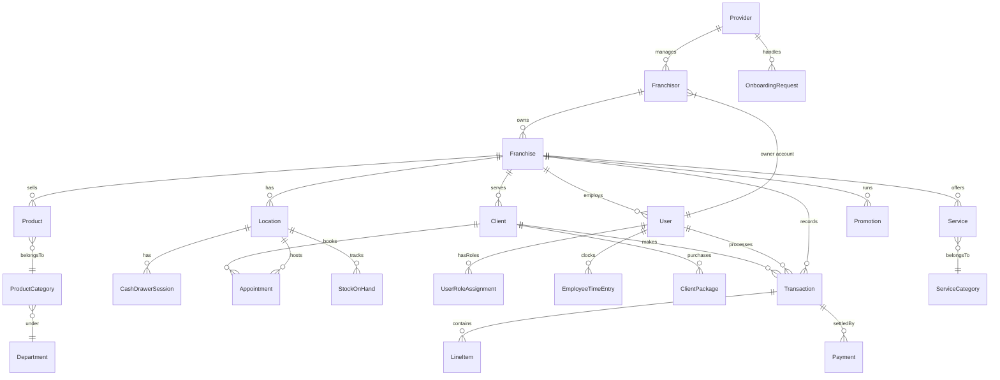

# Database ER Diagram

## Multi-Tenant Architecture Overview

## Core Domain Models

### Multi-Tenant Hierarchy
| Level | Model | Description |
|-------|-------|-------------|
| 1 | `Provider` | SaaS platform owner |
| 2 | `Franchisor` | Brand/franchise network owner |
| 3 | `Franchise` | Individual business entity |
| 4 | `Location` | Physical store location |

### POS & Transactions
| Model | Purpose | Key Relations |
|-------|---------|---------------|
| `Transaction` | Records sales | Employee, Client, LineItems, CashDrawerSession |
| `LineItem` | Individual sale items | Transaction, Product/Service |
| `CashDrawerSession` | Cash drawer lifecycle | Location, Employee |
| `Payment` | Payment methods | Transaction |

### Inventory & Products
| Model | Purpose | Key Relations |
|-------|---------|---------------|
| `Product` | Sellable items | Franchise, Category, Suppliers |
| `ProductCategory` | Product grouping | Department, Products |
| `Department` | Top-level grouping | Categories |
| `StockOnHand` | Per-location inventory | Location, Product |
| `StockAdjustment` | Inventory changes | Product, Employee |

### Services & Appointments
| Model | Purpose | Key Relations |
|-------|---------|---------------|
| `Service` | Offered services | Franchise, Category |
| `Appointment` | Scheduled bookings | Client, Employee, Services |
| `ServiceCategory` | Service grouping | Services |

### Clients & Loyalty
| Model | Purpose | Key Relations |
|-------|---------|---------------|
| `Client` | Customer records | Franchise, Transactions, Appointments |
| `LoyaltyProgram` | Points program config | Franchise |
| `LoyaltyMember` | Program enrollment | Program, Client |
| `PointsTransaction` | Points history | Member, Transaction |

### Users & Permissions
| Model | Purpose | Key Relations |
|-------|---------|---------------|
| `User` | System users | Franchise, Roles |
| `Role` | Permission templates | Permissions |
| `UserRoleAssignment` | Role assignments | User, Role, Location |
| `Permission` | Granular access | Roles |

## Key Relationships Summary

| Parent Model | Child Models | Cascade Behavior |
|--------------|--------------|------------------|
| `Franchise` | Location, User, Product, Service, Client, Transaction | `onDelete: Cascade` |
| `Location` | CashDrawerSession, StockOnHand, Appointment | `onDelete: Cascade` |
| `Transaction` | LineItem | `onDelete: Cascade` |
| `Client` | Appointment, Package, Transaction | `onDelete: Cascade` |
| `Product` | LineItem, StockOnHand, StockAdjustment | `onDelete: Restrict` |

## Model Count
- **137 total models** in schema
- **211 indexes** for performance
- **278 foreign key relations**
- **21 unique constraints**
