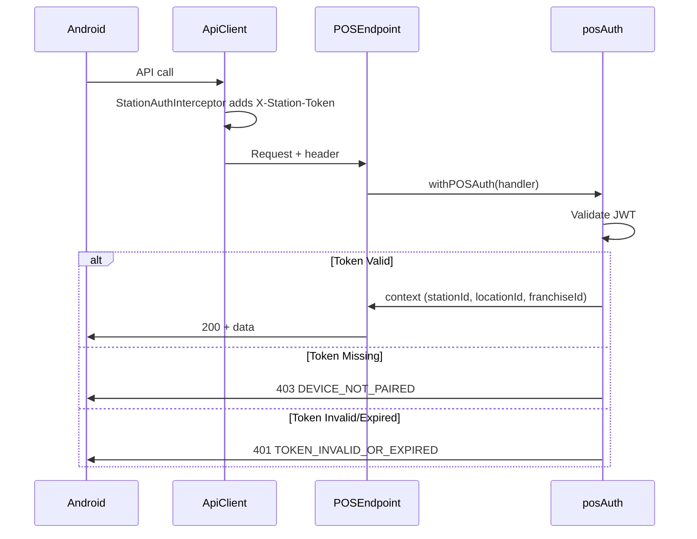

# POS Auth Contract

## Header
All POS API endpoints require the `X-Station-Token` header:
```
X-Station-Token: <JWT>
```

## Status Codes

| Code | Response | Android Action |
|------|----------|---------------|
| `200` | Success + data | Continue |
| `401` | `TOKEN_INVALID_OR_EXPIRED` | Show re-pair modal |
| `403` | `DEVICE_NOT_PAIRED` | Show pairing screen |

## JWT Payload
```json
{
  "stationId": "cmk...",
  "locationId": "cmk...",
  "franchiseId": "cmk...",
  "deviceFingerprint": "abc123",
  "stationName": "REG1",
  "issuedAt": 1706000000000
}
```

## Token Lifetime
- **Expiry:** 90 days
- **Revocation:** Dashboard → Devices → Revoke Station

## Protected Endpoints
All `/api/pos/**` routes require stationToken:
- `/api/pos/menu`
- `/api/pos/employees-for-login`
- `/api/pos/bootstrap`
- `/api/pos/staff`
- `/api/pos/station/config`
- `/api/pos/transaction`

## Architecture


